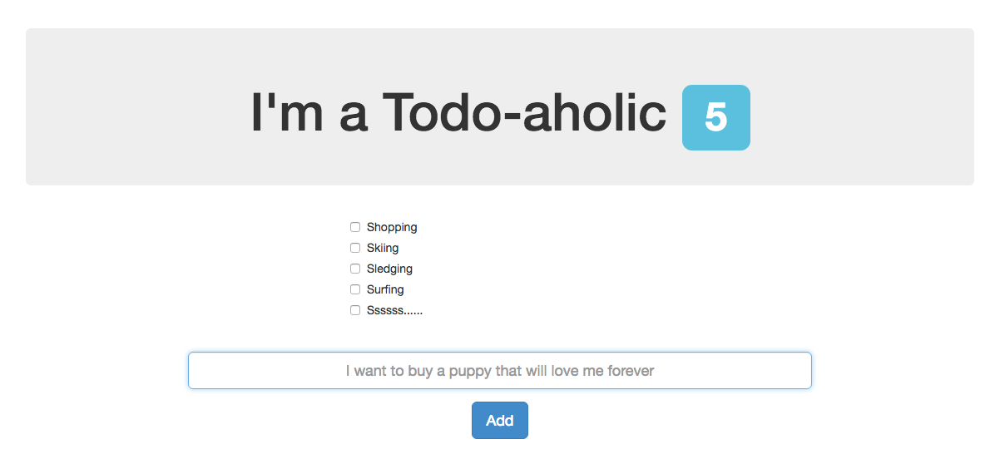

Todos in AngularJS
====

A single page todo app using Node, AngularJS and MongoDB.

I followed this [excellent tutorial](https://scotch.io/tutorials/creating-a-single-page-todo-app-with-node-and-angular) by Chris Sevilleja.
I also set up Karma, Jasmine and Protractor for testing.

About
----
This was a very nice little project to get up to speed on MongoDB. I ran into some issues with routing as I'd never done it before and tried to use a custom directory structure.

This hiccup meant I ended up frustrated and didn't end up using TDD.

To Add/ Next time
---

Next time I will aim to use TDD from the start. It would also be nice to create user specific logins and deploy it.

Also I would like to add my own styling potentially using some CSS animations.
